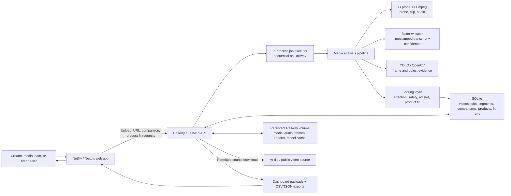
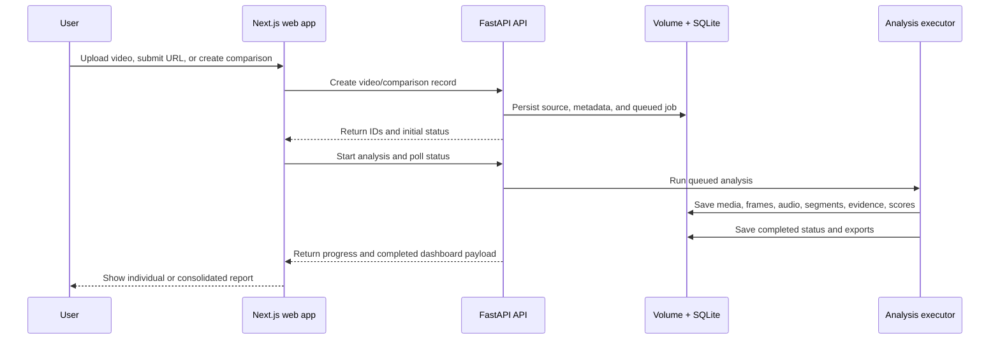

# NeuroAd Context Engine

NeuroAd Context Engine is a full-stack AI MVP for moment-level video intelligence. It lets a user upload a short video, paste a direct video file URL, or ingest a permitted YouTube URL, then generates a dashboard with attention proxy scoring, object/context moments, transcript topics, ad-fit recommendations, creator insights, and exportable CSV/JSON reports.

The product is intentionally positioned as an **Attention Proxy Score** system. It does not claim to read minds, predict guaranteed human attention, or perform actual TRIBE v2 brain-response inference. TRIBE-style brain-response research is represented only as a future research-mode placeholder.

## Product Summary

The app answers a practical creator/adtech question:

> Which exact moments inside a video are strongest, weakest, or best suited for contextual ad placement?

It analyzes video at the segment level using:

- Frame sampling
- Audio energy
- Speech-to-text
- Object detection
- Topic classification
- Attention proxy scoring
- Contextual ad matching
- Plain-English recommendations

## Capabilities Being Introduced

The capabilities in this section are implemented and testable on `codex/brand-fit-engine`. They are documented on `main` so stakeholders can understand the planned V1.0 expansion before the implementation is merged.

### Analyze one video

Creators, media teams, and brand teams can upload a supported video, provide a direct media URL, or ingest a YouTube video they are permitted to analyze. The product creates a timestamped report that surfaces the strongest hook, weak moments, attention and drop-risk patterns, contextual ad categories, evidence quality, and the strongest generic ad-slot candidate.

### Compare two to five videos

Users can upload multiple videos into one comparison. The system produces an individual report for every completed video and a consolidated report that ranks videos on attention, monetization opportunity, brand safety, transcript clarity, visual quality, creator readiness, and ad-slot strength.

When exactly two videos are completed, the report adds an A/B view: metric-by-metric deltas, a directional winner, and evidence confidence. Same-category videos are compared on the same metric schema; mixed-category comparisons remain deliberately directional and carry a caveat rather than pretending they share a calibrated benchmark.

### Check whether a brand or product fits a video

On an individual dashboard, a user can paste a public product or brand URL. The system extracts available structured product information, asks the user to review it, and then tests the reviewed profile against the completed video. The output is a fit tier, confidence, and ranked placement windows with human-readable reasons.

This is decision support: it identifies contextual opportunities worth reviewing. It does not promise viewer attention, brand lift, conversion, campaign performance, or legal suitability.

## How It Works in Plain Language

1. The user gives NeuroAd a video or an allowed video link.
2. The engine divides it into short moments instead of judging the entire video as one block.
3. For each moment, it checks what is visible, what is said, how dynamic the scene is, and whether the evidence is reliable.
4. It turns those signals into practical indicators: likely attention quality, risk of a viewer drop, contextual category fit, and brand-safety signals.
5. It highlights the moments that are most suitable for a generic sponsorship or ad message, and explains why.
6. If a product is added, the engine looks for product, category, audience, and prohibited-context cues. It then recommends the best timestamp to introduce that product—or advises against placement when evidence is weak.

The dashboard is designed to make the decision inspectable. Every recommendation links back to timestamps, transcript/visual evidence, and the component scores that informed it.

## Current MVP Status

This repository contains a working local MVP:

- Next.js dashboard frontend
- FastAPI backend
- SQLite persistence
- Local file storage
- In-process background jobs
- Real uploaded-video analysis
- Real direct-video-URL analysis
- Permitted YouTube ingestion through `yt-dlp`
- CSV and JSON exports
- Dark pitch-black UI
- Dashboard trend graph with annotated high/low/ad-fit moments

Sample/mock analysis is disabled in the current build. Completed dashboards should come from real uploaded media, permitted YouTube ingestion, or direct video file URLs.

### Feature-Branch Release Scope

The multi-video comparison, A/B analysis, explainable strongest ad-slot score, faster-whisper evidence improvements, and review-first product-fit engine are implemented on the `codex/brand-fit-engine` branch. They should be tested in that branch before being merged into `V1.0`.

## Repository Structure

```text
.
├── apps
│   ├── api
│   │   ├── main.py
│   │   ├── requirements.txt
│   │   ├── tests
│   │   │   └── test_scoring.py
│   │   └── storage
│   │       ├── audio
│   │       ├── frames
│   │       ├── reports
│   │       ├── samples
│   │       └── uploads
│   └── web
│       ├── src
│       │   ├── app
│       │   ├── components
│       │   └── lib
│       ├── package.json
│       └── tailwind.config.ts
├── DEPLOYMENT.md
├── package.json
├── package-lock.json
└── README.md
```

## Tech Stack

### Frontend

- Next.js
- React
- TypeScript
- Tailwind CSS
- Recharts
- TanStack Query
- Zustand
- Lucide React icons

### Backend

- FastAPI
- SQLite
- Local file storage
- In-process background jobs with `ThreadPoolExecutor`
- Static media serving through FastAPI

### AI/Video Pipeline

- FFmpeg and FFprobe
- OpenCV
- OpenAI Whisper open-source package in the current V1.0 runtime
- faster-whisper with CPU INT8 inference on `codex/brand-fit-engine`
- Ultralytics YOLO
- NumPy
- pandas
- yt-dlp for permitted YouTube media ingestion

## Target Feature-Branch Architecture



### Deployment Boundary

- **Netlify** serves the Next.js application. It handles the user interface and calls the API URL configured through `NEXT_PUBLIC_API_BASE`.
- **Railway** runs FastAPI, FFmpeg/FFprobe, the in-process job executor, local SQLite database, and the persistent volume. Video analysis must remain on the backend because it requires long-running processes and file writes. The expanded comparison and product-fit records shown in the diagram are part of the feature-branch release scope.
- **Railway volume** is required in the current MVP so uploaded media, generated reports, SQLite records, and downloaded model files survive restarts.
- **Future production architecture** replaces local SQLite and file storage with PostgreSQL plus object storage, and replaces in-process jobs with a queue and separate workers.

### Request and Processing Flow



## Key Features

### Landing/Input Page

Route:

```text
/
```

The landing page includes:

- Product name: `NeuroAd Context Engine`
- Paste video URL input
- YouTube permission checkbox
- Upload video section
- Pitch-black dashboard aesthetic
- Live output preview visualization
- Concept explainer cards

Supported input types:

- Uploaded MP4/MOV/WebM/M4V
- Direct public video file URLs ending in `.mp4`, `.mov`, `.webm`, or `.m4v`
- YouTube URLs only when the user confirms they own or have permission to analyze the video

### Processing Page

Route:

```text
/analyze/[videoId]
```

The processing page starts the analysis job and polls job status.

Visible processing steps:

```text
metadata
frames
audio
transcript
objects
topics
attention
ad_scoring
report
```

When the job completes, the frontend automatically routes to:

```text
/dashboard/[videoId]
```

### Dashboard Page

Route:

```text
/dashboard/[videoId]
```

Dashboard sections:

- Header with export buttons
- Overall video trend graph
- Summary metric cards
- Attention timeline
- Segment drawer
- Segments tab
- Objects tab
- Transcript tab
- Ad Matches tab
- Recommendations tab
- Brand and product-fit panel

The top dashboard chart shows:

- Full Attention Proxy Score trend
- Dashed Ad Fit trend
- Annotated peak attention point
- Annotated lowest attention point
- Annotated best ad-fit point

### Multi-Video Comparison

Routes:

```text
/compare
/compare/analyze/[comparisonId]
/compare/[comparisonId]
```

The comparison flow accepts two to five uploads. It processes videos sequentially in the current Railway-safe MVP so a small deployment does not try to transcode several videos at once. Each video retains its own dashboard and report; the comparison dashboard adds:

- Completed, processing, and failed state for each source video
- Same-category or mixed-category comparison mode
- Inferred category and category confidence per video
- Overall ranking, normalized score, percentile position, and evidence confidence
- Metric comparison for attention, monetization, drop risk, safety, visual quality, transcript clarity, creator readiness, and ad-slot strength
- Shared and video-specific keywords
- Two-video A/B deltas and a directional winner when there are exactly two completed videos
- Consolidated CSV and JSON exports

### Brand and Product Fit Panel

The individual video dashboard includes a review-first Brand and Product Fit panel.

1. A user pastes a public HTTP(S) product or brand page.
2. The backend rejects loopback/private-network addresses and validates redirect targets before retrieval.
3. JSON-LD `Product`, Open Graph, and standard metadata are used to propose a name, brand, description, category, image, and keywords.
4. The user can edit product/category/audience keywords and prohibited contexts before saving the profile.
5. The backend calculates a video fit run and returns ranked segment placements, recommendations, placement type, score, confidence, and evidence reasons.

The user stays in control of the product profile. Extracted web metadata is never treated as verified brand guidance until it has been reviewed in the UI.

### Report Page

Route:

```text
/reports/[reportId]
```

The current report page is a read-only report route scaffold that fetches analysis data using the report/video id.

### Exports

The completed dashboard supports:

- CSV export
- JSON export

Exports are generated from real segment data after processing is complete.

## Backend API

Base URL locally:

```text
http://localhost:8000
```

### Upload Video

```http
POST /api/videos/upload
```

Request:

```multipart
file: video.mp4
```

Response:

```json
{
  "video_id": "video_123",
  "status": "uploaded"
}
```

### Create Direct URL Video

```http
POST /api/videos/url
```

Request:

```json
{
  "url": "https://example.com/video.mp4"
}
```

This registers the URL quickly. The actual download happens inside the processing job so the user sees the progress screen.

### Fetch YouTube Metadata

```http
POST /api/videos/youtube
```

Request:

```json
{
  "url": "https://www.youtube.com/watch?v=..."
}
```

This endpoint creates a metadata-only YouTube record and embed preview.

### Ingest Permitted YouTube URL

```http
POST /api/videos/youtube/ingest
```

Request:

```json
{
  "url": "https://www.youtube.com/watch?v=...",
  "has_permission": true
}
```

This registers a YouTube ingestion job. The actual media download happens during analysis with `yt-dlp`.

Important: YouTube can return HTTP 403 from some cloud or local environments. If that happens, upload the video file directly or configure cookies.

### Start Analysis

```http
POST /api/videos/{video_id}/analyze
```

Response:

```json
{
  "job_id": "job_123",
  "status": "queued"
}
```

### Get Job Status

```http
GET /api/jobs/{job_id}
```

Response:

```json
{
  "id": "job_123",
  "video_id": "video_123",
  "status": "processing",
  "progress": 62,
  "current_step": "objects",
  "error": null
}
```

### Check Runtime Dependencies

```http
GET /api/system/dependencies
```

Response includes:

- FFmpeg availability
- FFprobe availability
- yt-dlp availability
- YouTube cookie configuration status

### Fetch Analysis

```http
GET /api/videos/{video_id}/analysis
```

Returns the full dashboard payload:

### Incoming Feature-Branch APIs

The following APIs are implemented on `codex/brand-fit-engine` and documented here ahead of the V1.0 merge.

#### Resolve and Review a Product Link

```http
POST /api/products/resolve
```

The backend fetches only public HTTP(S) pages, rejects loopback/private-network addresses and validates redirects. It extracts JSON-LD and Open Graph product fields, but the UI requires the user to review them before a profile is saved.

```http
POST /api/products
POST /api/videos/{video_id}/product-fit
POST /api/comparisons/{comparison_id}/product-fit
```

Product-fit results combine reviewed product/category/audience terms with transcript, topics, detected objects, brand safety, attention, drop-risk and natural-boundary signals. They return a fit tier, evidence confidence, and ranked timestamp placements. These are decision-support scores, not a claim of campaign performance or viewer conversion.

#### Create and Analyze a Comparison

```http
POST /api/comparisons
POST /api/comparisons/{comparison_id}/videos/upload
POST /api/comparisons/{comparison_id}/analyze
GET /api/comparisons/{comparison_id}/status
GET /api/comparisons/{comparison_id}
GET /api/comparisons/{comparison_id}/export?format=csv
GET /api/comparisons/{comparison_id}/export?format=json
```

Example creation request:

```json
{
  "title": "Summer campaign creative test"
}
```

Each comparison accepts two to five videos. The status endpoint returns per-video progress so the web app can display partial progress while the sequential batch is running. The completed payload includes individual report links, rankings, category mode, metric comparison, keywords, A/B analysis when exactly two videos are complete, caveats, and recommendations.

#### Product-Fit Result Model

For each completed video, a product-fit run records:

- `overall_fit_score`: combined opportunity across the leading placement windows
- `fit_confidence`: reliability of the product-context evidence
- `suitability_tier`: `Strong fit`, `Conditional fit`, `Weak fit`, or `Not suitable`
- `placements`: timestamped recommendations sorted by placement score
- `reasons`: the product/category/audience/visual/safety evidence used for each placement

Product profiles, original extraction snapshots, fit runs, and placements are stored separately so source metadata and each analysis result remain traceable.
```json
{
  "video": {},
  "summary": {},
  "segments": [],
  "objects": [],
  "topics": [],
  "ad_matches": [],
  "recommendations": [],
  "exports": {}
}
```

### Export Analysis

```http
GET /api/videos/{video_id}/export?format=csv
GET /api/videos/{video_id}/export?format=json
```

Exports are only available after the video status is `completed`.

## Analysis Pipeline

The current backend pipeline lives in:

```text
apps/api/main.py
```

High-level flow:

```text
Input media
  -> validate source
  -> download/register source if needed
  -> probe duration with FFprobe
  -> segment video
  -> sample frames with OpenCV
  -> extract audio with FFmpeg
  -> transcribe audio with Whisper
  -> detect objects with YOLO
  -> classify topics
  -> compute Attention Proxy Score
  -> compute Ad Fit Score
  -> write SQLite rows
  -> generate CSV/JSON exports
  -> dashboard payload
```

### Backend Job Lifecycle

The API creates a `videos` record first, then creates a `jobs` record when analysis starts. The job progresses through metadata, frames, audio, transcript, object detection, topics, attention, ad scoring, and report generation. The UI polls the job status and never needs to wait on a single HTTP request for the full analysis.

For comparisons, the API persists a parent `comparisons` record and `comparison_videos` membership rows. The current executor processes the selected videos one at a time, updates the member and parent counters after each result, and leaves completed individual reports available even if another member fails. A consolidated report is available once at least two videos complete.

### Media and Evidence Processing

| Stage | Backend process | Stored evidence | Why it matters |
| --- | --- | --- | --- |
| Source intake | Validates file extension/size or registers a URL; permitted YouTube media is downloaded during analysis. | Video metadata and source record. | Makes the source traceable and applies limits before heavy work starts. |
| Probe and segmentation | FFprobe reads duration; the backend creates short time windows. | Segment start/end timestamps. | All later recommendations can point to a specific moment. |
| Frame analysis | OpenCV samples frames; YOLO is used when available to identify visual objects. | Frame thumbnails, detected objects, confidence, bounding boxes. | Supports visual context and object evidence. |
| Audio and transcript | FFmpeg creates analysis audio; faster-whisper runs CPU INT8 inference with timestamped segments, language metadata, word confidence, VAD/no-speech indicators when available. Vosk remains a fallback. | Transcript text and transcript-quality evidence. | Makes spoken context and transcript reliability visible. |
| Context and safety | Keyword/topic logic identifies broad content context and transcript flags. | Topics, claims/risk flags, safety-related evidence. | Prevents a recommendation from being based only on a visually attractive frame. |
| Scoring | The backend combines per-segment evidence into attention, drop risk, ad fit, ad-slot, and product-fit scores. | Component reasons, recommendation tier, confidence, evidence mode. | Keeps the result inspectable instead of returning only a black-box score. |
| Reporting | SQLite records are assembled into dashboard payloads and CSV/JSON exports. | Individual reports, comparison reports, product-fit runs and placements. | Makes results reusable across UI, exports, and later comparisons. |

### Evidence Confidence and Fallback Behavior

The system records whether a recommendation is supported by transcript-plus-visual, audio-plus-visual, visual-only, or weak evidence. Missing speech, weak word confidence, low visual quality, no clear objects, high drop risk, and safety concerns lower confidence or move a recommendation into an edit/review tier.

No fallback turns missing evidence into certainty. For example, a person-only detection is treated as generic context rather than product proof, and a weak transcript cannot by itself create a strong product-placement recommendation.

### Segmentation Rules

- Videos under 60 seconds use 2-second segments.
- Longer videos use 5-second segments.
- MVP analysis is capped to the first 3 minutes.

### Object Detection

YOLO detections are sampled from extracted frames. The app keeps the highest-confidence objects per segment.

### Transcript

Whisper is used for timestamped speech-to-text. If Whisper or audio processing fails in a constrained environment, the job returns a clear failed step and error message.

### Topic Classification

The app currently uses keyword/category fallback logic around these categories:

- fitness
- finance
- beauty
- skincare
- gaming
- education
- productivity
- startup
- travel
- food
- fashion
- entertainment
- parenting
- technology
- health
- luxury
- automobiles

### Attention Proxy Score

The score is bounded from 0 to 100 and combines:

- visual novelty
- object clarity
- audio energy
- speech density
- scene change
- topic clarity
- hook/CTA signal

Labels:

```text
80-100: High attention
60-79: Good attention
40-59: Neutral
20-39: Drop risk
0-19: Weak moment
```

The current weighted implementation emphasizes visual novelty, movement, object clarity, visual quality, scene change, speech pacing, hook/CTA signals, audio energy, and topic clarity. Silence, repetition, and blur reduce the score. It is an explainable proxy for creative momentum—not measured human attention.

### Ad Fit Score

The current contextual ad matcher uses:

- object/category overlap
- transcript/topic overlap
- metadata matching
- attention score
- brand-safety baseline

Current ad catalog categories include:

- Productivity SaaS
- AI Note-taking App
- Coffee Brand
- Fitness Product
- Creator Gear
- Fashion / Apparel

### Strongest Ad-Slot Score

The strongest generic ad slot is not simply the highest-attention moment. It combines:

- attention quality: 25%
- contextual ad fit: 25%
- inverse drop risk: 15%
- brand safety: 15%
- natural boundary: 10%
- evidence confidence: 10%

The natural-boundary component favors moments with a speech pause, slower speech pacing, or a suitable visual transition. The dashboard shows these component reasons so a user can reject a technically high score that does not fit their creative judgment.

### Product-Fit and Placement Score

The product-fit engine starts only after a reviewed product profile exists. It compares product keywords, category, intended audience, and prohibited contexts with the segment transcript, summary, topic labels, and visual objects. It also considers transcript confidence, visual quality, brand safety, generic ad-slot quality, attention, drop risk, and a natural boundary.

Prohibited-context matches sharply reduce the score and mark the segment as blocked. The system returns `Strong fit`, `Conditional fit`, `Weak fit`, or `Not suitable`; a placement recommendation is never a guarantee that a brand should approve or buy that placement.

## Local Development

### Prerequisites

Install:

- Node.js 18 or newer
- npm
- Python 3.10 or 3.11 recommended
- FFmpeg and FFprobe

On macOS:

```bash
brew install ffmpeg
```

Check FFmpeg:

```bash
ffmpeg -version
ffprobe -version
```

### Install Dependencies

From the repository root:

```bash
npm install
```

Create and activate the Python environment:

```bash
python3 -m venv apps/api/.venv
source apps/api/.venv/bin/activate
pip install -r apps/api/requirements.txt
```

### Run Backend

From the repository root:

```bash
npm run dev:api
```

This runs:

```bash
cd apps/api && uvicorn main:app --reload --host 0.0.0.0 --port 8000
```

### Run Frontend

In a second terminal:

```bash
npm run dev:web
```

Open:

```text
http://localhost:3000
```

### Production-style Local Run

Build the web app:

```bash
npm --workspace apps/web run build
```

Start it:

```bash
npm --workspace apps/web exec next start -- --hostname 127.0.0.1 --port 3000
```

Start the API:

```bash
cd apps/api
uvicorn main:app --host 127.0.0.1 --port 8000
```

### Docker Local Run

After installing Docker Desktop, build and run the API plus web app:

```bash
npm run docker:up
```

Open:

```text
http://localhost:3000
```

The API is exposed at:

```text
http://localhost:8000
```

Useful Docker commands:

```bash
npm run docker:build
npm run docker:down
docker compose logs -f api
docker compose logs -f web
```

Docker stores backend uploads, frames, audio, reports, and SQLite data in the named volume:

```text
neuroad-api-data
```

## Environment Variables

### Frontend

```bash
NEXT_PUBLIC_API_BASE=http://localhost:8000
```

If omitted, the frontend defaults to:

```text
http://localhost:8000
```

For a public website, never deploy with the localhost value. `localhost`
inside a visitor's browser means the visitor's own computer, not the
NeuroAd server. Deploy the API to a public HTTPS URL and build the web app
with that URL:

```bash
NEXT_PUBLIC_API_BASE=https://api.your-domain.com
```

Then set the API CORS origins to the exact public website origin:

```bash
CORS_ORIGINS=https://your-web-domain.com
```

Because `NEXT_PUBLIC_API_BASE` is baked into the Next.js browser bundle at
build time, redeploy/rebuild the web app after changing it.

### Backend

```bash
NEUROAD_STORAGE_DIR=./storage
NEUROAD_DB_PATH=./storage/neuroad.db
NEUROAD_WORKERS=1
NEUROAD_MAX_UPLOAD_MB=200
NEUROAD_MAX_SOURCE_SECONDS=600
NEUROAD_MAX_ANALYSIS_SECONDS=180
NEUROAD_MODEL_DIR=./models
NEUROAD_ENABLE_TRANSCRIPTION=1
NEUROAD_TRANSCRIPTION_ENGINE=vosk
NEUROAD_REQUIRE_TRANSCRIPTION=0
NEUROAD_ENABLE_OBJECT_DETECTION=1
NEUROAD_OBJECT_DETECTION_ENGINE=yolo
NEUROAD_REQUIRE_OBJECT_DETECTION=0
VOSK_MODEL_DIR=./models/vosk-model-small-en-us-0.15
MOBILENET_SSD_GRAPH=./models/mobilenet-ssd/frozen_inference_graph.pb
MOBILENET_SSD_CONFIG=./models/mobilenet-ssd/ssd_mobilenet_v1_coco.pbtxt
CORS_ORIGINS=http://localhost:3000,http://127.0.0.1:3000
YTDLP_COOKIES_FILE=/absolute/path/to/cookies.txt
YTDLP_COOKIES_BROWSER=chrome
```

Notes:

- `NEUROAD_STORAGE_DIR` controls where uploads, frames, audio, and reports are written.
- `NEUROAD_DB_PATH` controls the SQLite database path.
- `NEUROAD_WORKERS` controls in-process job concurrency.
- Keep it low on CPU-only machines.
- On the current `main` Docker image, `NEUROAD_TRANSCRIPTION_ENGINE=vosk` uses the small offline Vosk model installed by Docker.
- `NEUROAD_TRANSCRIPTION_ENGINE=whisper` opts into the existing Whisper path after installing `requirements-whisper.txt`.
- On `codex/brand-fit-engine`, `NEUROAD_TRANSCRIPTION_ENGINE=faster_whisper` is the preferred CPU INT8 path and Vosk remains the fallback.
- `NEUROAD_ENABLE_TRANSCRIPTION=0` skips transcription completely.
- `NEUROAD_OBJECT_DETECTION_ENGINE=yolo` uses the configured Ultralytics YOLO model. The current Dockerfile enables the lightweight `yolov8n.pt` path by default.
- `NEUROAD_OBJECT_DETECTION_ENGINE=mobilenet_ssd` is available as an OpenCV DNN fallback when the MobileNet-SSD files are installed.
- `NEUROAD_ENABLE_OBJECT_DETECTION=0` skips model-based object detection and uses the OpenCV visual-context fallback.
- `NEUROAD_REQUIRE_TRANSCRIPTION=1` or `NEUROAD_REQUIRE_OBJECT_DETECTION=1` makes missing model files fail the job instead of falling back.
- `CORS_ORIGINS` is required for deployed Netlify origins.
- `YTDLP_COOKIES_FILE` is preferred over browser-cookie extraction in deployed environments.

### Feature-Branch Docker Model Configuration

On `codex/brand-fit-engine`, the Dockerfile enables faster-whisper and YOLO by default, with Vosk and MobileNet-SSD available as fallback components. Rebuild the API image after pulling model or Docker changes:

```bash
docker compose build api --no-cache
docker compose up
```

The relevant Docker build args are:

```bash
INSTALL_VOSK=1
INSTALL_MOBILENET_SSD=1
INSTALL_WHISPER=1
INSTALL_YOLO=1
```

The runtime env is:

```bash
NEUROAD_ENABLE_TRANSCRIPTION=1
NEUROAD_TRANSCRIPTION_ENGINE=faster_whisper
NEUROAD_ENABLE_OBJECT_DETECTION=1
NEUROAD_OBJECT_DETECTION_ENGINE=yolo
```

### Optional Lightweight Fallbacks

If a smaller or more constrained environment cannot use the default model stack, Vosk and MobileNet-SSD can be retained as fallback paths. Set `INSTALL_WHISPER=0` or `INSTALL_YOLO=0` at image build time only when the corresponding runtime engine is also changed.

To install faster-whisper locally in the Python environment:

```bash
source apps/api/.venv/bin/activate
pip install -r apps/api/requirements-whisper.txt
```

To include it in a Docker build:

```bash
docker compose build api --build-arg INSTALL_WHISPER=1
```

Then set:

```bash
NEUROAD_ENABLE_TRANSCRIPTION=1
```

### YOLO and OpenCV Fallback

With `NEUROAD_ENABLE_OBJECT_DETECTION=0`, the backend uses an OpenCV-only visual-context fallback. It can identify coarse face/person-like context and scene tags such as bright, low-light, colorful, or detailed, but it should not be interpreted as product evidence.

To install YOLO locally:

```bash
source apps/api/.venv/bin/activate
pip install -r apps/api/requirements-yolo.txt
```

To include YOLO in a Docker build:

```bash
docker compose build api --build-arg INSTALL_YOLO=1
```

Then set:

```bash
NEUROAD_ENABLE_OBJECT_DETECTION=1
```

## Storage

Local storage lives under:

```text
apps/api/storage
```

Subdirectories:

```text
uploads/   uploaded/downloaded video files
frames/    extracted frame thumbnails
audio/     extracted audio files
reports/   generated CSV/JSON exports
samples/   reserved for sample fixtures
```

SQLite database:

```text
apps/api/storage/neuroad.db
```

Core records are intentionally separated by responsibility:

| Record group | Purpose |
| --- | --- |
| `videos`, `jobs` | Source metadata, analysis lifecycle, progress, and failures. |
| `segments`, `detected_objects`, `topics`, `ad_matches` | Timestamp-level evidence and scoring output for one video. |
| `comparisons`, `comparison_videos`, `comparison_reports` | Multi-video membership, batch state, and consolidated exports. |
| `products`, `product_snapshots` | Reviewed product profiles and the source metadata captured at creation time. |
| `product_fit_runs`, `product_placements` | Immutable product-to-video fit output and placement recommendations. |

The MVP stores this data locally on the Railway volume. It is sufficient for single-service testing; workspaces, multi-instance deployment, and formal retention controls require the planned PostgreSQL and object-storage migration.

The repository intentionally ignores generated media, reports, the SQLite database, virtual environments, model weights, and build outputs.

## Git Ignore Policy

Ignored examples:

- `node_modules/`
- `.next/`
- Docker named volumes
- `.venv/`
- `apps/api/.venv/`
- generated uploaded videos
- generated frames
- generated audio
- generated reports
- SQLite database
- `.pt` model weights
- `.onnx` model weights
- `.env`
- `.env.local`

Only `.gitkeep` files inside storage folders are committed.

## Testing

### Backend Tests

```bash
apps/api/.venv/bin/pytest apps/api/tests
```

or, when the local virtual environment exists:

```bash
npm run test:api
```

Current tests cover scoring behavior.

### Frontend Lint

```bash
npm run lint:web
```

### Frontend Build

```bash
npm run build:web
```

## Deployment Strategy

See the detailed deployment guide:

[DEPLOYMENT.md](./DEPLOYMENT.md)

Recommended MVP deployment:

```text
Netlify:
  Next.js frontend

Railway:
  FastAPI backend
  FFmpeg/FFprobe
  Vosk + OpenCV MobileNet-SSD
  Railway volume mounted at /data

Later:
  PostgreSQL
  Cloudflare R2/S3/Supabase Storage
  Redis queue
  separate Python worker
  optional GPU worker
```

Do not deploy this as a Netlify-only app. The backend needs long-running Python work, local file writes, and system-level video tooling.

## YouTube Ingestion Notes

YouTube ingestion is supported only when the user confirms they own or have permission to analyze the video.

The app uses `yt-dlp` for permitted media ingestion.

If a YouTube stream fails with HTTP 403:

1. Try a video you own that is public or unlisted.
2. Upload the video file directly.
3. Provide a direct MP4/MOV/WebM/M4V URL.
4. Configure cookies:

```bash
YTDLP_COOKIES_FILE=/absolute/path/to/cookies.txt npm run dev:api
```

or:

```bash
YTDLP_COOKIES_BROWSER=chrome npm run dev:api
```

Cloud hosting providers may still receive 403 responses from YouTube because of datacenter IP restrictions.

## Security and Privacy Notes

This is an MVP, not a production security model.

Current protections:

- Upload format validation
- 200 MB upload limit
- Analysis duration capped to first 3 minutes
- Product-link validation for HTTP(S), public DNS targets, and redirect targets
- Loopback, private-network, link-local, multicast, reserved, and `.local` product URLs rejected
- Review-first product profiles; extracted web metadata is not automatically treated as verified
- Local storage ignored from Git
- YouTube permission checkbox
- No training on uploaded videos

Before public launch, add:

- Authentication
- Rate limiting
- Signed upload URLs
- Virus/malware scanning for uploads
- User-owned private storage
- Delete video/report endpoint
- Storage retention policy
- Job retry policies
- Audit logging

## Known Limitations

- SQLite is local and not suitable for multi-instance production.
- File storage is local and should move to object storage for public demos.
- Video jobs run in-process; a separate worker queue is better for production.
- CPU-only Whisper/YOLO processing can be slow.
- YouTube ingestion can fail with HTTP 403.
- No authentication yet.
- No payment or workspace management.
- No production brand-safety classifier.
- TRIBE v2 inference is not implemented.

## Troubleshooting

### Frontend cannot reach backend

Check:

```bash
NEXT_PUBLIC_API_BASE
```

Default expected API:

```text
http://localhost:8000
```

Make sure FastAPI is running:

```bash
curl http://localhost:8000/api/system/dependencies
```

If public users see an error mentioning `http://localhost:8000`, the web app
was deployed with the local development API URL. Fix the hosting environment
variable:

```bash
NEXT_PUBLIC_API_BASE=https://api.your-domain.com
```

Then redeploy the frontend and make sure the backend has:

```bash
CORS_ORIGINS=https://your-web-domain.com
```

### FFmpeg missing

Install FFmpeg:

```bash
brew install ffmpeg
```

Verify:

```bash
ffmpeg -version
ffprobe -version
```

### OpenCV/Whisper/YOLO import errors

Activate the API virtual environment and reinstall dependencies:

```bash
source apps/api/.venv/bin/activate
pip install -r apps/api/requirements.txt
```

### YouTube returns 403

Use direct upload as the reliable path, or configure cookies:

```bash
YTDLP_COOKIES_FILE=/absolute/path/to/cookies.txt npm run dev:api
```

### Dashboard says analysis is not complete

Check the job:

```bash
curl http://localhost:8000/api/jobs/{job_id}
```

If the job failed, the `error` field will show the failed step and message.

### Large files are rejected

The MVP limit is:

```text
200 MB
```

Use a shorter clip or compress the file.

## Development Workflow

Typical local workflow:

```bash
npm install

python3 -m venv apps/api/.venv
source apps/api/.venv/bin/activate
pip install -r apps/api/requirements.txt

npm run dev:api
npm run dev:web
```

Quality checks:

```bash
apps/api/.venv/bin/pytest apps/api/tests
npm run lint:web
npm run build:web
```

## Roadmap

### V1.0

- Local MVP
- Upload/direct URL/YouTube ingestion
- Real video analysis
- Dashboard trend graph
- CSV/JSON export
- Deployment strategy

### V1.1

- Netlify deployment config
- Dockerfile for API
- Health endpoint
- Configurable storage and database paths
- Configurable CORS origins
- Better report route and share links

### V2

- PostgreSQL
- S3/R2/Supabase Storage
- Redis queue
- Separate worker service
- GPU-backed processing option
- Auth and workspaces
- Multi-video creative comparison
- Product-fit ranking across a multi-video comparison
- Calibrated category benchmarks based on approved category-specific reference data
- Semantic brand-safety and product-context models with evaluation datasets

### V3

- Brand-safety classifier
- Product catalog upload
- Creator/brand matching
- Optional TRIBE v2 research-mode integration
- Production-grade report sharing

## License and Model Notes

This repository is an MVP implementation for product/demo exploration.

Third-party libraries and models have their own licenses. Review licenses for:

- Whisper
- Ultralytics YOLO
- yt-dlp
- FFmpeg

TRIBE v2 is referenced only as product inspiration and future research-mode framing. Do not present this MVP as actual brain-reading or guaranteed attention prediction.
