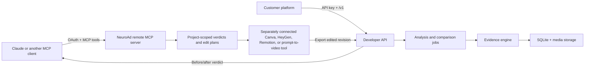

# NeuroAd MCP Server and Developer API

Status: first vertical slice on `codex/mcp-server-developer-api`.

## Product decision and idea rating

This is an **8.5/10 product direction**. It turns NeuroAd from a report destination into an intelligence layer that can be used inside an AI assistant, an editing workflow, or a customer's own platform. The strongest wedge is not “another video generator”; it is an evidence and evaluation loop that helps several generators produce a better revision and checks the result before publishing.

The main product risks are vendor API differences, long-running video jobs, inference cost, and overclaiming what attention proxies predict. The design addresses those with a provider-neutral edit-plan schema, asynchronous jobs, project quotas, explicit approval before an MCP-triggered analysis, and evidence-linked limitations in every plan.

## Implemented vertical slice

- Remote Streamable HTTP MCP endpoint at `/mcp`.
- OAuth 2.1-style authorization-code flow with dynamic public-client registration, PKCE data preservation, short-lived access tokens, rotating refresh tokens, and token revocation.
- Project isolation for every MCP video and comparison lookup.
- MCP tools for listing videos, reading verdicts, reading comparisons, building edit plans, requesting approval, and starting an approved analysis.
- A reusable MCP prompt for the “improve before publishing” workflow.
- Developer API v1 with API-key scopes, upload-only batches, asynchronous status/results, comparisons, improvement plans, and revision uploads.
- Maximum 10 files per public batch and 10 videos per month on the bootstrap free project.
- Thirty-minute free-project media retention, beginning when analysis completes or fails. Analysis metadata remains available after source and derived media are purged.
- Idempotency keys for batch and revision writes.
- Revision lineage (`parent_video_id`, `root_video_id`, and `revision_number`) so an edited export can be analyzed without losing its original.

## Architecture



NeuroAd does not pretend that one generic API call can edit in every vendor. The current contract creates a provider-neutral `neuroad.edit-plan.v1` handoff containing timestamped operations, evidence references, priority, a prompt, and the expected exported-video result. Claude can pass that plan to a separately connected editor. Managed provider adapters are a later layer over the same schema.

## Configuration

Use Python 3.10 or newer; the production Docker image uses Python 3.11.

```dotenv
NEUROAD_PUBLIC_API_BASE=https://api.example.com
NEUROAD_REQUIRE_MCP=1
NEUROAD_BOOTSTRAP_API_KEY=nad_replace_with_a_long_random_secret
```

`NEUROAD_PUBLIC_API_BASE` must be the externally reachable HTTPS origin because it is used in OAuth metadata, consent redirects, approval links, and protected-resource metadata. The bootstrap key creates one free project on first startup. Store it only in the API service's secret manager and replace the bootstrap flow with project/key management before general availability.

For Claude, add this remote MCP URL as a custom connector:

```text
https://api.example.com/mcp
```

During authorization, NeuroAd shows its own consent page. The user enters a project API key there; Claude receives a scoped OAuth token, not that API key.

## MCP contract

| Capability | MCP primitive | Side effect |
| --- | --- | --- |
| Recent project videos | `list_videos` tool | None |
| Evidence-grounded verdict | `get_video_verdict` tool and `neuroad://videos/{id}/verdict` resource | None |
| Provider-neutral edit instructions | `create_improvement_plan` tool | None |
| Consolidated comparison | `get_comparison_verdict` tool | None |
| Prepare a potentially billable run | `request_analysis_approval` tool | Creates a 15-minute approval request |
| Execute the approved run | `start_approved_analysis` tool | Starts analysis only for the exact approved video and plan fingerprint |
| Guided editing loop | `improve_before_publishing` prompt | None |

An approval is project-bound, target-bound, fingerprint-bound, expiring, and single-use. Replaying a consumed approval returns the existing job instead of creating a duplicate.

## Developer API contract

All project endpoints use:

```http
Authorization: Bearer nad_...
```

Write endpoints also require:

```http
Idempotency-Key: a-unique-key-from-the-caller
```

### Create an analysis batch

```bash
curl -X POST https://api.example.com/v1/batches \
  -H "Authorization: Bearer $NEUROAD_API_KEY" \
  -H "Idempotency-Key: campaign-42-upload-1" \
  -F "mode=analyze" \
  -F "title=Campaign 42" \
  -F "files=@cut-a.mp4" \
  -F "files=@cut-b.mp4"
```

Use `mode=compare` with 2–10 files for one consolidated comparison. The API returns a `batch_id`; poll status and retrieve results asynchronously.

```http
GET /v1/batches/{batch_id}
GET /v1/batches/{batch_id}/results
GET /v1/videos/{video_id}/analysis
```

### Create an editor-ready plan

```bash
curl -X POST https://api.example.com/v1/videos/video_123/improvement-plans \
  -H "Authorization: Bearer $NEUROAD_API_KEY" \
  -H "Content-Type: application/json" \
  -d '{"objective":"attention","target_provider":"heygen","custom_instruction":"Make the benefit clear in the first three seconds"}'
```

The response includes a deterministic `plan_fingerprint`, evidence-linked `actions`, and `destination_handoff`. Creating a plan is read-only. Any tool that executes it should preserve the original and ask for human approval under its own permission model.

### Upload and re-analyze an edited revision

```bash
curl -X POST https://api.example.com/v1/videos/video_123/revisions \
  -H "Authorization: Bearer $NEUROAD_API_KEY" \
  -H "Idempotency-Key: video-123-heygen-revision-1" \
  -F "file=@edited-output.mp4"
```

The response returns the new `video_id`, analysis `job_id`, and revision lineage. Poll the new video analysis, then use the original and revision outputs in the customer's evaluation UI or submit both exports as a comparison batch.

## Security and operational boundaries

- API keys are stored as SHA-256 hashes; raw keys are never persisted.
- OAuth access and refresh tokens are also stored as hashes.
- OAuth authorization codes are short-lived and single-use.
- Project ownership is checked at each API and MCP data access.
- Free-project media is deleted after its terminal-state retention window; verdict records remain for audit and comparison.
- Attention, drop-risk, ad-fit, and safety outputs are decision support, not guaranteed human response or campaign performance.
- SQLite and an in-process executor are appropriate for this single-instance beta only. Multi-instance production needs PostgreSQL, object storage, a durable queue, signed uploads, distributed rate limiting, metering, and audit-event export.

## Delivery roadmap

### Phase 1 — foundation (implemented in this branch)

- Remote MCP, project OAuth, scoped API keys, batch analysis/comparison, edit-plan handoff, approval gate, revision lineage, and retention.

### Phase 2 — private beta

- Project/key management UI, signed object-storage uploads, webhooks, per-project rate limits, usage dashboard, and a durable worker queue.
- Automatic before/after comparison for a revision lineage.
- Audit log for OAuth grants, approvals, provider handoffs, and analysis charges.

### Phase 3 — managed editor adapters

- Adapter interface over `neuroad.edit-plan.v1`.
- Start with one provider whose API supports deterministic exports and timeline operations; Remotion is a practical engineering-first candidate, while HeyGen is strong for avatar/prompt workflows.
- Canva and other providers should only be marked “direct edit” after their current APIs expose the required operations and export lifecycle. Otherwise, expose a guided handoff instead of claiming the edit happened.

### Phase 4 — platform scale

- Organizations, RBAC, service accounts, billable usage, SLA tiers, longer retention options, regional storage, and provider marketplace.
